<div align="center">

```
███╗   ██╗ ██████╗ ██╗   ██╗ █████╗ ███████╗██╗  ██╗██╗   ██╗██╗     ██████╗
████╗  ██║██╔═══██╗██║   ██║██╔══██╗██╔════╝██║  ██║╚██╗ ██╔╝██║     ██╔══██╗
██╔██╗ ██║██║   ██║██║   ██║███████║███████╗███████║ ╚████╔╝ ██║     ██║  ██║
██║╚██╗██║██║   ██║╚██╗ ██╔╝██╔══██║╚════██║██╔══██║  ╚██╔╝  ██║     ██║  ██║
██║ ╚████║╚██████╔╝ ╚████╔╝ ██║  ██║███████║██║  ██║   ██║   ███████╗██████╔╝
╚═╝  ╚═══╝ ╚═════╝   ╚═══╝  ╚═╝  ╚═╝╚══════╝╚═╝  ╚═╝   ╚═╝   ╚══════╝╚═════╝
```

# NovaShyld\_Task\_2

**Network Analysis & System Understanding**

*Network Security Internship Program — NovaShyld Technologies*

---


</div>

---

<div align="center">

```
░█████╗░██╗░░░██╗███████╗██████╗░██╗░░░██╗██╗███████╗░██╗░░░░░░░██╗
██╔══██╗██║░░░██║██╔════╝██╔══██╗██║░░░██║██║██╔════╝░██║░░██╗░░██║
██║░░██║╚██╗░██╔╝█████╗░░██████╔╝╚██╗░██╔╝██║█████╗░░░╚██╗████╗██╔╝
██║░░██║░╚████╔╝░██╔══╝░░██╔══██╗░╚████╔╝░██║██╔══╝░░░░████╔═████║░
╚█████╔╝░░╚██╔╝░░███████╗██║░░██║░░╚██╔╝░░██║███████╗░░╚██╔╝░╚██╔╝░
░╚════╝░░░░╚═╝░░░╚══════╝╚═╝░░╚═╝░░░╚═╝░░░╚═╝╚══════╝░░░╚═╝░░░╚═╝░░
```

</div>

## Overview

This repository documents the completion of **Task 2** of the NovaShyld Technologies Network Security Internship Program. The task focused on building practical, hands-on knowledge in three core domains: networking fundamentals, live traffic analysis and reconnaissance, and introductory cryptography.

All practical activities were performed inside a controlled lab environment using **Kali Linux** as the attacker machine and **Metasploitable 2** as the target, configured on a Host-Only network to ensure a safe, isolated environment.

---

<div align="center">

```
░█████╗░██████╗░     ██╗███████╗░█████╗░████████╗██╗██╗░░░██╗███████╗░██████╗
██╔══██╗██╔══██╗     ██║██╔════╝██╔══██╗╚══██╔══╝██║██║░░░██║██╔════╝██╔════╝
██║░░██║██████╦╝     ██║█████╗░░██║░░╚═╝░░░██║░░░██║╚██╗░██╔╝█████╗░░╚█████╗░
██║░░██║██╔══██╗██╗  ██║██╔══╝░░██║░░██╗░░░██║░░░██║░╚████╔╝░██╔══╝░░░╚═══██╗
╚█████╔╝██████╦╝╚█████╔╝███████╗╚█████╔╝░░░██║░░░██║░░╚██╔╝░░███████╗██████╔╝
░╚════╝░╚═════╝░ ╚════╝░╚══════╝░╚════╝░░░░╚═╝░░░╚═╝░░░╚═╝░░░╚══════╝╚═════╝░
```

</div>

## Objectives

- Understand the OSI and TCP/IP models and how they apply to real network communication
- Capture and analyze live network traffic using Wireshark
- Identify and interpret TCP 3-Way Handshakes and DNS queries from packet captures
- Perform network reconnaissance using Nmap for port scanning and service detection
- Conduct banner grabbing using Netcat to extract service information from open ports
- Generate cryptographic hash values using SHA256 and MD5
- Encrypt and decrypt files using OpenSSL with AES-256-CBC symmetric encryption

---

<div align="center">

```
████████╗ ██████╗  ██████╗ ██╗      ███████╗
╚══██╔══╝██╔═══██╗██╔═══██╗██║      ██╔════╝
   ██║   ██║   ██║██║   ██║██║      ███████╗
   ██║   ██║   ██║██║   ██║██║      ╚════██║
   ██║   ╚██████╔╝╚██████╔╝███████╗ ███████║
   ╚═╝    ╚═════╝  ╚═════╝ ╚══════╝ ╚══════╝
```

</div>

## Tools & Technologies

| Tool | Purpose |
|------|---------|
|  | Live packet capture and traffic analysis |
|  | Port scanning and service version detection |
|  | Banner grabbing and manual port connection |
|  | File encryption, decryption, and hash generation |
|  | Primary attack and analysis platform |
|  | Intentionally vulnerable target machine |

---

## Project Structure

```
NovaShyld_Task_2/
│
├── README.md
│
├── Report/
│   └── Task_2_Report.pdf
│
└── Screenshots/
    ├── live-traffic.png
    ├── 3-way-handshake.png
    ├── dns-query.png
    ├── nmap-scan.png
    ├── nmap-sv.png
    ├── sudo-nmap-p.png
    ├── netcat-port-21.png
    ├── netcat-port-22.png
    ├── generate-hash.png
    ├── encrypt-file-using-openssl.png
    ├── decrypt-file-using-openssl.png
    ├── openssl.png
    └── plain-and-cipher-files.png
```

---

<div align="center">

```
███╗   ███╗███████╗████████╗██╗  ██╗ ██████╗ ██████╗  ██████╗ ██╗      ██████╗  ██████╗██╗   ██╗
████╗ ████║██╔════╝╚══██╔══╝██║  ██║██╔═══██╗██╔══██╗██╔═══██╗██║     ██╔═══██╗██╔════╝╚██╗ ██╔╝
██╔████╔██║█████╗     ██║   ███████║██║   ██║██║  ██║██║   ██║██║     ██║   ██║██║  ███╗╚████╔╝ 
██║╚██╔╝██║██╔══╝     ██║   ██╔══██║██║   ██║██║  ██║██║   ██║██║     ██║   ██║██║   ██║ ╚██╔╝  
██║ ╚═╝ ██║███████╗   ██║   ██║  ██║╚██████╔╝██████╔╝╚██████╔╝███████╗╚██████╔╝╚██████╔╝  ██║   
╚═╝     ╚═╝╚══════╝   ╚═╝   ╚═╝  ╚═╝ ╚═════╝ ╚═════╝  ╚═════╝ ╚══════╝ ╚═════╝  ╚═════╝   ╚═╝   
```

</div>

## Methodology

### Packet Analysis — Wireshark

Wireshark was used to capture live network traffic by selecting the active network interface on the Kali Linux machine. The capture allowed for real-time inspection of individual packets, including their source, destination, protocol, and payload.

Filters were applied to isolate specific traffic types, including TCP handshakes (`tcp.flags.syn == 1`) and DNS queries (`dns`), enabling focused analysis of network behavior.

---

### Port Scanning — Nmap

Nmap was used to identify open ports on the Metasploitable 2 target machine. A basic scan was first performed to discover the most common ports, followed by a comprehensive full-port scan. Service version detection was then performed to identify the exact software and version running on each open port.

---

### Banner Grabbing — Netcat

Netcat was used to manually connect to open ports on the target machine. Upon connection, the service responds with a banner message that reveals its name, version, and sometimes the operating system. This provides confirmation of what is running on each port and is used to identify potentially vulnerable software.

---

### Cryptography — OpenSSL

Hash values were generated for a sample file using both SHA256 and MD5 algorithms to demonstrate integrity verification. File encryption was then performed using AES-256-CBC symmetric encryption via OpenSSL, and the encrypted file was subsequently decrypted to restore the original content.

---

<div align="center">

```
██████╗ ███████╗███████╗██╗   ██╗██╗  ████████╗███████╗
██╔══██╗██╔════╝██╔════╝██║   ██║██║  ╚══██╔══╝██╔════╝
██████╔╝█████╗  ███████╗██║   ██║██║     ██║   ███████╗
██╔══██╗██╔══╝  ╚════██║██║   ██║██║     ██║   ╚════██║
██║  ██║███████╗███████║╚██████╔╝███████╗██║   ███████║
╚═╝  ╚═╝╚══════╝╚══════╝ ╚═════╝ ╚══════╝╚═╝   ╚══════╝
```

</div>

## Results & Screenshots

---

### Live Traffic Capture

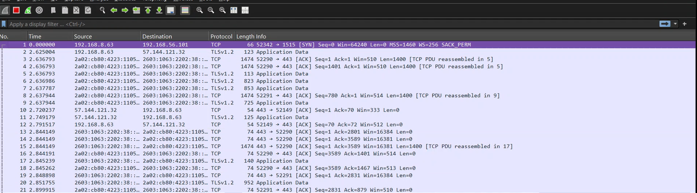

> Wireshark interface showing live packets being captured on the active network interface, with packet details displayed in real time.

---

### TCP 3-Way Handshake

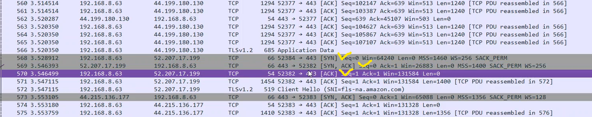

> Wireshark capture showing the SYN, SYN-ACK, and ACK packets that establish a TCP connection between the Kali machine and the target.

---

### DNS Query Analysis

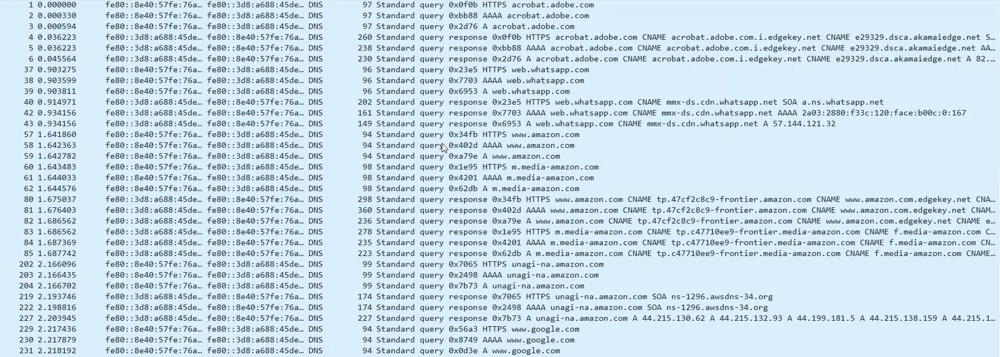

> Wireshark capture filtered to display DNS query and DNS response packets, showing domain-to-IP resolution in action.

---

### Nmap Port Scan

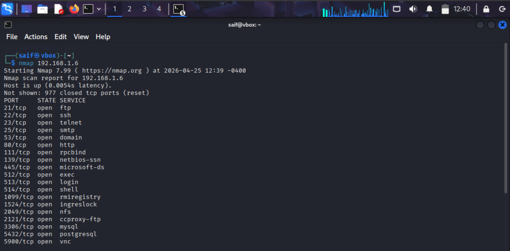

> Nmap output showing open ports discovered on the Metasploitable 2 target machine during a standard scan.

---

### Nmap Service Version Detection

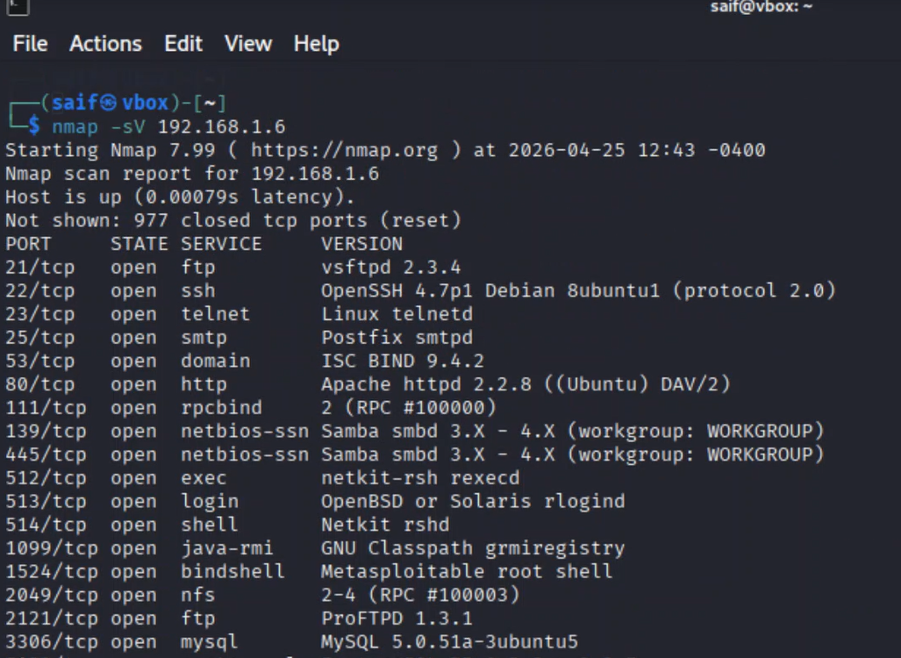

> Nmap -sV output identifying service names and version numbers running on each open port of the target machine.

---

### Full Port Scan (All Ports)

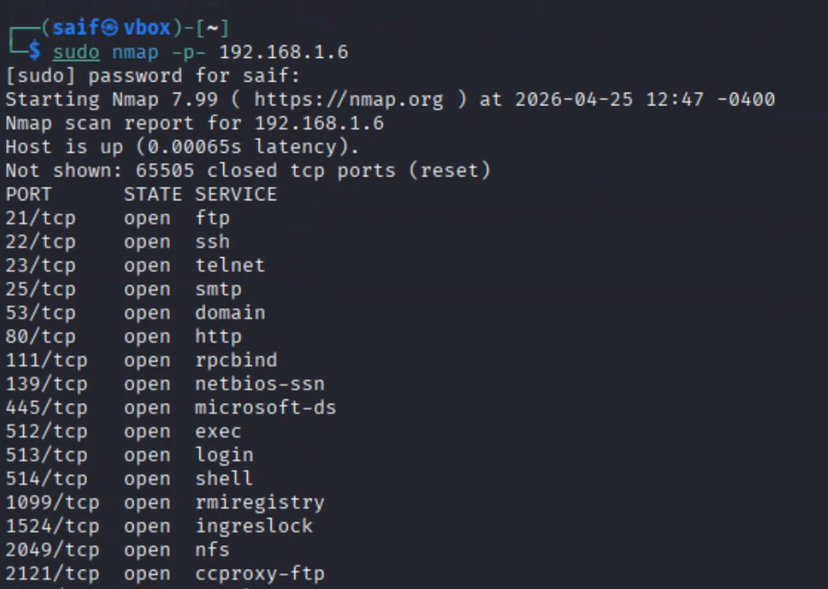

> Output of the comprehensive sudo nmap -p- command, scanning all 65535 ports to ensure no open port is missed.

---

### Netcat Banner Grab — Port 21 (FTP)

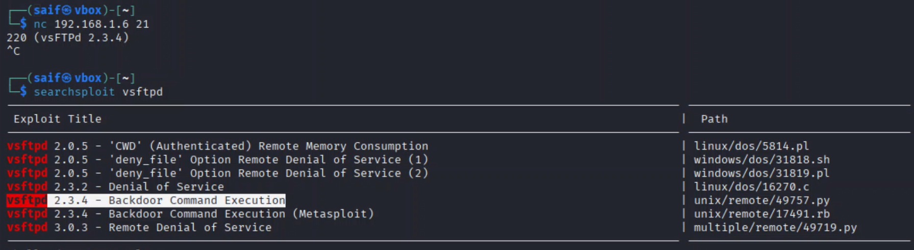

> Netcat connection to port 21, showing the FTP service banner returned by the Metasploitable target, including server name and version.

---

### Netcat Banner Grab — Port 22 (SSH)

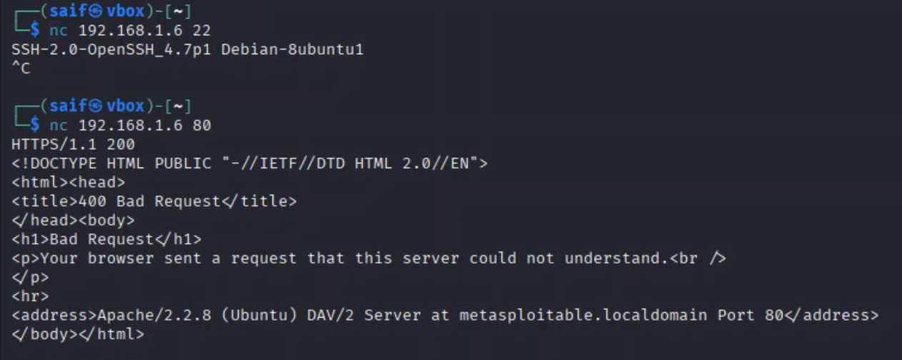

> Netcat connection to port 22, showing the SSH service banner with protocol version and software details.

---

### Hash Generation

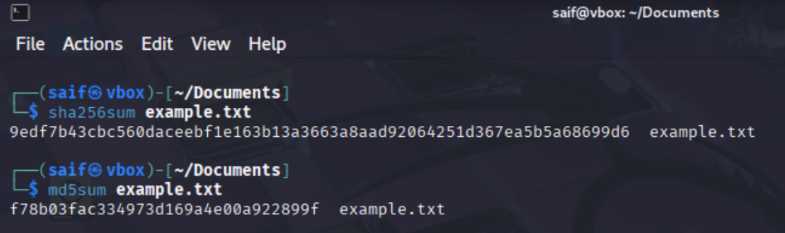

> Terminal output showing SHA256 and MD5 hash values generated for a sample text file, demonstrating cryptographic integrity verification.

---

### File Encryption Using OpenSSL

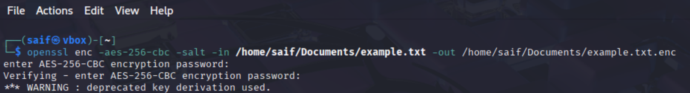

> OpenSSL AES-256-CBC encryption command converting a plaintext file into an encrypted .enc file after password entry.

---

### File Decryption Using OpenSSL

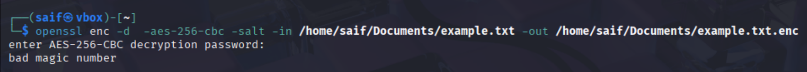

> OpenSSL decryption command restoring the original plaintext file from the encrypted .enc file using the correct password.

---

### OpenSSL Overview

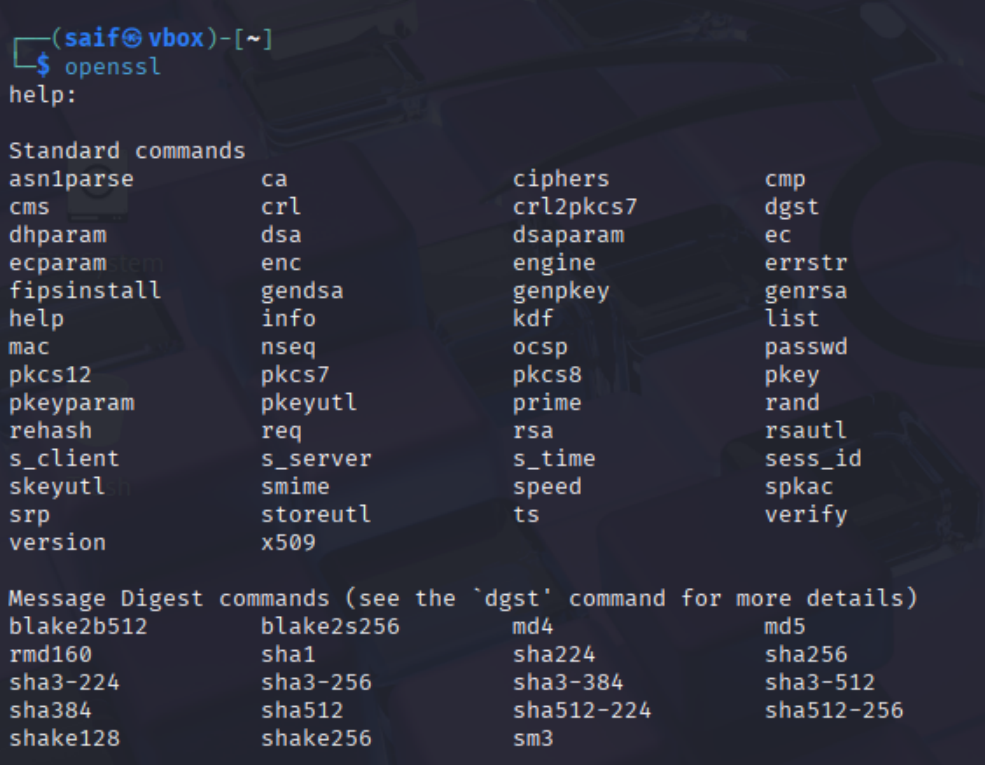

> OpenSSL tool information showing available commands and the installed version on the Kali Linux machine.

---

### Plain and Cipher Files

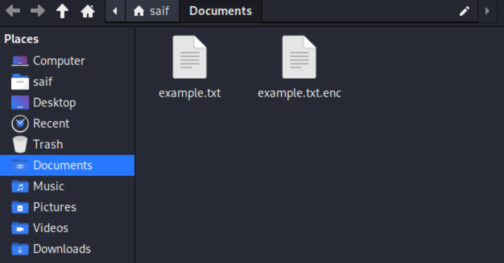

> File manager view showing both the original plaintext file and its encrypted counterpart, confirming successful encryption output.

---

<div align="center">

```
░█████╗░░█████╗░███╗░░░███╗███╗░░░███╗░█████╗░███╗░░██╗██████╗░░██████╗
██╔══██╗██╔══██╗████╗░████║████╗░████║██╔══██╗████╗░██║██╔══██╗██╔════╝
██║░░╚═╝██║░░██║██╔████╔██║██╔████╔██║███████║██╔██╗██║██║░░██║╚█████╗░
██║░░██╗██║░░██║██║╚██╔╝██║██║╚██╔╝██║██╔══██║██║╚████║██║░░██║░╚═══██╗
╚█████╔╝╚█████╔╝██║░╚═╝░██║██║░╚═╝░██║██║░░██║██║░╚███║██████╔╝██████╔╝
░╚════╝░░╚════╝░╚═╝░░░░░╚═╝╚═╝░░░░░╚═╝╚═╝░░╚═╝╚═╝░░╚══╝╚═════╝░╚═════╝░
```

</div>

## Commands Used

### Nmap

```bash
# Basic port scan (top 1000 ports)
nmap <target-ip>

# Full port scan (all 65535 ports)
sudo nmap -p- <target-ip>

# Service and version detection
nmap -sV <target-ip>
```

---

### Netcat — Banner Grabbing

```bash
# Connect to FTP service
nc <target-ip> 21

# Connect to SSH service
nc <target-ip> 22

# Connect to HTTP service
nc <target-ip> 80
```

---

### Hash Generation

```bash
# Generate SHA256 hash
sha256sum example.txt

# Generate MD5 hash
md5sum example.txt
```

---

### OpenSSL — Encryption and Decryption

```bash
# Encrypt a file using AES-256-CBC
openssl enc -aes-256-cbc -salt -pbkdf2 -in file.txt -out file.txt.enc

# Decrypt the encrypted file
openssl enc -d -aes-256-cbc -pbkdf2 -in file.txt.enc -out decrypted_file.txt
```

---

<div align="center">

```
██████╗  ██████╗  ██████╗██╗   ██╗███╗   ███╗███████╗███╗   ██╗████████╗ █████╗ ████████╗██╗ ██████╗ ███╗   ██╗
██╔══██╗██╔═══██╗██╔════╝██║   ██║████╗ ████║██╔════╝████╗  ██║╚══██╔══╝██╔══██╗╚══██╔══╝██║██╔═══██╗████╗  ██║
██║  ██║██║   ██║██║     ██║   ██║██╔████╔██║█████╗  ██╔██╗ ██║   ██║   ███████║   ██║   ██║██║   ██║██╔██╗ ██║
██║  ██║██║   ██║██║     ██║   ██║██║╚██╔╝██║██╔══╝  ██║╚██╗██║   ██║   ██╔══██║   ██║   ██║██║   ██║██║╚██╗██║
██████╔╝╚██████╔╝╚██████╗╚██████╔╝██║ ╚═╝ ██║███████╗██║ ╚████║   ██║   ██║  ██║   ██║   ██║╚██████╔╝██║ ╚████║
╚═════╝  ╚═════╝  ╚═════╝ ╚═════╝ ╚═╝     ╚═╝╚══════╝╚═╝  ╚═══╝   ╚═╝   ╚═╝  ╚═╝   ╚═╝   ╚═╝ ╚═════╝ ╚═╝  ╚═══╝
```

</div>

## Documentation

The complete internship report for Task 2 is available in the repository. It includes detailed explanations of all concepts, step-by-step methodology, command breakdowns, and annotated screenshots.

[Download Full Report](Report/Task_2_Report.pdf)

---

<div align="center">

```
░█████╗░░█████╗░███╗░░██╗░█████╗░██╗░░░░░██╗░░░██╗░██████╗██╗░█████╗░███╗░░██╗
██╔══██╗██╔══██╗████╗░██║██╔══██╗██║░░░░░██║░░░██║██╔════╝██║██╔══██╗████╗░██║
██║░░╚═╝██║░░██║██╔██╗██║██║░░╚═╝██║░░░░░██║░░░██║╚█████╗░██║██║░░██║██╔██╗██║
██║░░██╗██║░░██║██║╚████║██║░░██╗██║░░░░░██║░░░██║░╚═══██╗██║██║░░██║██║╚████║
╚█████╔╝╚█████╔╝██║░╚███║╚█████╔╝███████╗╚██████╔╝██████╔╝██║╚█████╔╝██║░╚███║
░╚════╝░░╚════╝░╚═╝░░╚══╝░╚════╝░╚══════╝░╚═════╝░╚═════╝░╚═╝░╚════╝░╚═╝░░╚══╝
```

</div>

## Conclusion

Task 2 provided structured, practical exposure to the core techniques used by network security professionals. Beginning with foundational networking concepts and progressing through live traffic analysis, reconnaissance, and cryptographic operations, each module built upon the last to form a coherent and applicable skill set.

The use of industry-standard tools — Wireshark, Nmap, Netcat, and OpenSSL — within a controlled lab environment reinforced the importance of both offensive understanding and defensive awareness. Knowing how attackers gather information about a network is fundamental to building effective defenses against them.

These skills form a strong foundation for more advanced topics in penetration testing, incident response, and network hardening.

---

<div align="center">

*Developed as part of the Network Security Internship Program at NovaShyld Technologies*

</div>
